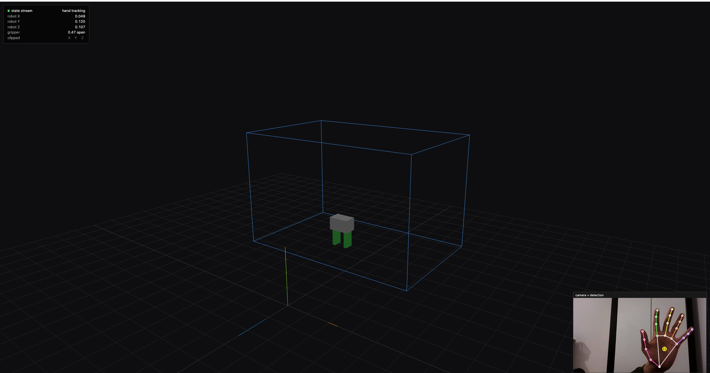

# robotics-perception-lab



A hands-on robotics perception lab built around a **Luxonis OAK-D** depth camera.
Each experiment is self-contained inside `experiments/NN_name/` with its own
README and runnable scripts — clone, install, point the camera at something,
and run.

## Hardware

| Component | What | Notes |
|---|---|---|
| Depth camera | Luxonis OAK-D (RVC2 / Movidius MyriadX) | 12MP color (IMX378), stereo pair (OV9282 + OV9282, 7.5 cm baseline), 9-DOF IMU (BNO086), on-device neural-network inference |
| Host | Mac mini (Apple Silicon) | Most pipelines also work on Linux/Windows with the same code |

No additional hardware required to run any current experiment.

## Install

```bash
# 1. Create / activate a Python 3.10+ environment (conda example)
conda create -n perception python=3.12 -y
conda activate perception

# 2. Install dependencies
pip install -r requirements.txt

# 3. Plug in the OAK-D over USB and verify it enumerates
python -c "import depthai as dai; print(dai.Device.getAllAvailableDevices())"

# 4. Download the MediaPipe Hands model (only needed by experiment 01)
mkdir -p models
curl -L -o models/hand_landmarker.task \
  https://storage.googleapis.com/mediapipe-models/hand_landmarker/hand_landmarker/float16/latest/hand_landmarker.task
```

## Experiments

| # | Name | Status | What it teaches |
|---|------|--------|-----------------|
| 01 | [Hand teleoperation (perception side)](experiments/01_hand_teleop/) | ✅ complete | Stereo depth tuning, 2D→3D unprojection with the pinhole model, MediaPipe hand tracking, EMA smoothing, frame transforms, workspace mapping, scale-invariant gripper command, live 3D viewer over SSE+three.js |

More to come — see [Roadmap](#roadmap).

## Repository layout

```
.
├── shared/              Reusable helpers
│   ├── oak.py             camera intrinsics + unproject(u,v,depth) -> XYZ
│   ├── smoothing.py       EmaFilter with dropout handling
│   └── retarget.py        palm-center + pinch + frame-transform + workspace map
├── experiments/NN_name/ One self-contained experiment per folder
├── models/              Downloaded ML models (gitignored, re-fetchable)
└── captures/            Scratch directory for recorded sessions (gitignored)
```

## License

MIT — see [LICENSE](LICENSE).
